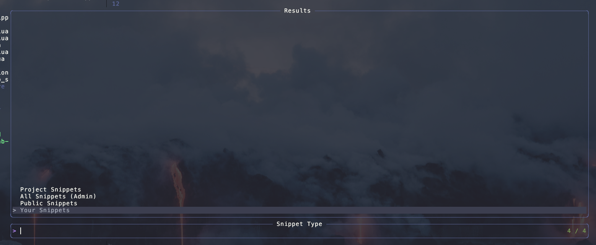
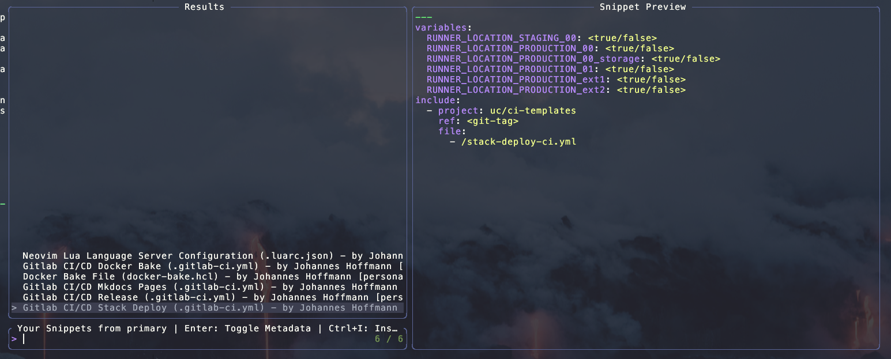

# Neovim GitLab Snippets

> [English translation here](/README_en.md)


Ein Neovim-Plugin, das es ermöglicht, GitLab-Code-Snippets direkt in Neovim zu durchsuchen, anzuzeigen und einzufügen. Dieses Plugin integriert sich mit Telescope, um eine nahtlose Benutzeroberfläche zu bieten.

## Funktionen

- Konfigurieren Sie mehrere GitLab-Instanzen mit verschiedenen Zugriffstoken
- Durchsuchen Sie Ihre persönlichen, öffentlichen oder alle Snippets
- Vorschau von Snippets vor der Verwendung
- **Umschalten zwischen Snippet-Inhalt und Metadaten-Vorschau mit der Enter-Taste**
- Einfügen von Snippets an der Cursorposition mit **Strg+I**
- Öffnen von Snippets in neuen Puffern mit **Strg+N**
- Volle Telescope-Integration mit direkten Tastenbindungsaktionen
- Gesundheitsprüfung zur Überprüfung der Konfiguration

## Anforderungen

- Neovim v0.10.0+
- [telescope.nvim](https://github.com/nvim-telescope/telescope.nvim)
- [plenary.nvim](https://github.com/nvim-lua/plenary.nvim)
- macOS ARM (offiziell unterstützt, kann auf anderen Plattformen funktionieren)

## Installation

### Verwendung von [lazy.nvim](https://github.com/folke/lazy.nvim)

```lua
{
  "https://git.unhappy.computer/hase808/neovim-gitlab-snippets",
  dependencies = {
    "nvim-lua/plenary.nvim",
    "nvim-telescope/telescope.nvim",
  },
  config = function()
    require("gitlab-snippets").setup({
      instances = {
        primary = { url = "https://gitlab.com" },
        work = { url = "https://gitlab.mycompany.com" },
      },
    })
  end,
}
```

## Konfiguration

Das Plugin erfordert, dass ein Persönliches GitLab-Zugriffstoken in einer Umgebungsvariablen festgelegt wird:
    - `GITLAB_SNIPPETS_TOKEN`: Standard-Token für alle Instanzen
    - `GITLAB_SNIPPETS_TOKEN_PRIMARY`: Token für die Instanz mit dem Namen "primary"
    - `GITLAB_SNIPPETS_TOKEN_WORK`: Token für die Instanz mit dem Namen "work"

Jedes Token sollte den `api`-Bereich haben, um auf Snippets zugreifen zu können.

## Verwendung

### Befehle

- `:GitLabSnippets`: Öffnen Sie den Telescope-Picker, um GitLab-Instanzen und Snippets zu durchsuchen

### Telescope-Integration

Das Plugin kann auch über Telescope aufgerufen werden:
```txt
:Telescope gitlab_snippets
```

### Workflow

1. Führen Sie `:GitLabSnippets` aus, um den Telescope-Picker zu öffnen
2. Wählen Sie eine GitLab-Instanz aus
3. Wählen Sie die Art der Snippets, die durchsucht werden sollen (persönlich, öffentlich, alle)
4. Wählen Sie ein Snippet aus der Liste aus (Vorschau wird automatisch angezeigt)
5. Verwenden Sie die verfügbaren Tastenbindungen:
   - **Enter**: Umschalten zwischen Snippet-Inhalt und Metadaten-Vorschau
   - **Strg+I**: Snippet an der Cursorposition einfügen
   - **Strg+N**: Snippet in einem neuen Puffer öffnen

### Verfügbare Tastenbindungen in der Snippet-Liste

Beim Durchsuchen von Snippets im Telescope-Picker stehen folgende Optionen zur Verfügung:

- **Enter**: Umschalten zwischen Snippet-Inhalt und Metadaten-Vorschau
- **Strg+I**: Das ausgewählte Snippet an der aktuellen Cursorposition einfügen
- **Strg+N**: Das ausgewählte Snippet in einem neuen Puffer öffnen
- **Esc**: Den Picker schließen, ohne eine Aktion auszuführen

Der Verweis auf die Tastenbindungen wird zur schnellen Orientierung auch im Titel des Pickers angezeigt.

### Snippet-Metadaten

Die Metadatenansicht zeigt umfassende Informationen zu jedem Snippet:

- **Grundlegende Informationen**: ID, Titel, Dateiname
- **Beschreibung**: Vollständige Snippet-Beschreibung
- **Autorendetails**: Name, Benutzername, E-Mail und Status
- **Zeitstempel**: Erstellungs- und letzte Aktualisierungsdaten
- **URLs**: Web-URL und URL des Rohinhalts
- **Zusätzliche Informationen**: Projekt-ID (für Projekt-Snippets), Importstatus

Es kann mit der **Enter**-Taste im Vorschaufenster zwischen dem Snippet-Inhalt und den Metadaten umgeschaltet werden.

### Healthcheck

Führen Sie `:checkhealth gitlab-snippets` aus, um zu überprüfen, ob:

- Alle erforderlichen Abhängigkeiten installiert sind
- GitLab-Instanzen korrekt konfiguriert sind
- Zugriffstoken verfügbar sind
- Verbindungen zu GitLab-Instanzen funktionieren

## Bilder






## Fehlerbehebung

### Token-Probleme

Bei Authentifizierungsfehlern sicherstellen, dass der Token:

- Korrekt in der Umgebungsvariablen gesetzt ist
- Nicht abgelaufen ist
- Den korrekten `api`-Bereich hat

### Verbindungsprobleme

Bei Verbindungsproblemen zu GitLab:

- Überprüfen Sie Ihre Netzwerkverbindung
- Überprüfen Sie, ob die URL der GitLab-Instanz korrekt ist
- Stellen Sie sicher, dass Ihr Token die korrekten Berechtigungen hat
