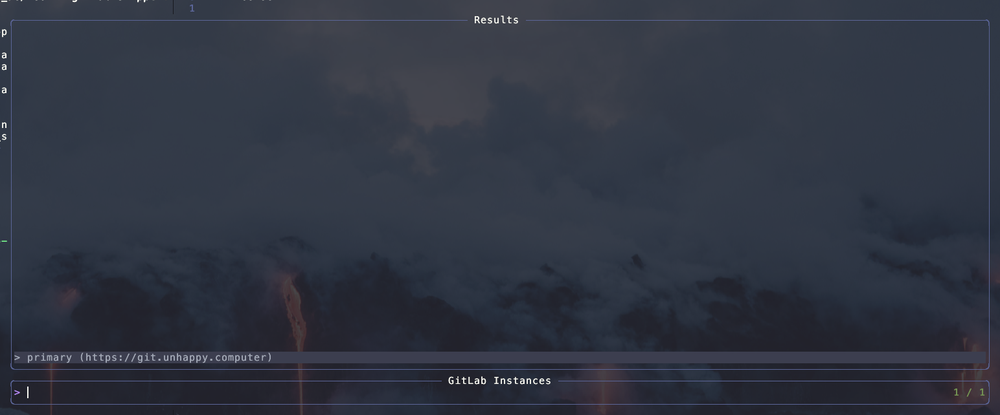
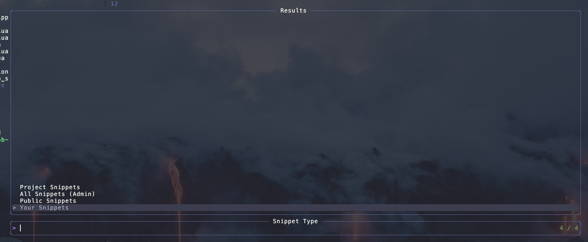
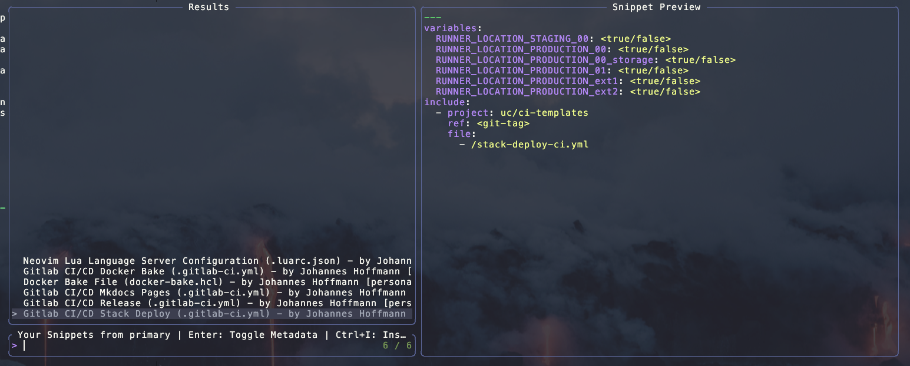

# Neovim GitLab Snippets

> [Deutsche Übersetzung hier](/README.md)


A Neovim plugin that allows you to browse, preview, and insert GitLab code snippets directly from within Neovim. This plugin integrates with Telescope to provide a seamless UI experience.

## Table of Contents

- [Features](#features)
- [Requirements](#requirements)
- [Installation](#installation)
- [Configuration](#configuration)
- [Usage](#usage)
  - [Commands](#commands)
  - [Telescope Integration](#telescope-integration)
  - [Workflow](#workflow)
  - [Available Keybinds in Snippet List](#available-keybinds-in-snippet-list)
  - [Snippet Metadata](#snippet-metadata)
  - [Health Checks](#health-checks)
- [Screenshots](#screenshots)
- [Vectorcode](#vectorcode)
- [Troubleshooting](#troubleshooting)
  - [Token Issues](#token-issues)
  - [Connection Problems](#connection-problems)

## Features

- Configure multiple GitLab instances with different access tokens
- Browse your personal, public, or all snippets
- Preview snippets before using them
- **Toggle between snippet content and metadata preview with Enter key**
- Insert snippets at cursor position with **Ctrl+I**
- Open snippets in new buffers with **Ctrl+N**
- Full Telescope integration with direct keybind actions
- Health check to verify configuration

## Requirements

- Neovim v0.10.0+
- [telescope.nvim](https://github.com/nvim-telescope/telescope.nvim)
- [plenary.nvim](https://github.com/nvim-lua/plenary.nvim)
- macOS ARM (officially supported, may work on other platforms)

## Installation

### Using [lazy.nvim](https://github.com/folke/lazy.nvim)

```lua
{
  "https://git.unhappy.computer/hase808/neovim-gitlab-snippets",
  dependencies = {
    "nvim-lua/plenary.nvim",
    "nvim-telescope/telescope.nvim",
  },
  config = function()
    require("gitlab-snippets").setup({
      instances = {
        primary = { url = "https://gitlab.com" },
        work = { url = "https://gitlab.mycompany.com" },
      },
    })
  end,
}
```

## Configuration

The plugin requires a GitLab Personal Access Token to be set in an environment variable:
    - `GITLAB_SNIPPETS_TOKEN`: Default token used for all instances
    - `GITLAB_SNIPPETS_TOKEN_PRIMARY`: Token for the instance named "primary"
    - `GITLAB_SNIPPETS_TOKEN_WORK`: Token for the instance named "work"

Each token should have the api scope to access snippets.

## Usage

### Commands

- `:GitLabSnippets`: Open the Telescope picker to browse GitLab instances and snippets

### Telescope Integration

You can also access the plugin through Telescope:
```txt
:Telescope gitlab_snippets
```

### Workflow

1. Run `:GitLabSnippets` to open the Telescope picker
2. Select a GitLab instance
3. Choose the type of snippets you want to browse (personal, public, all)
4. Select a snippet from the list (preview is shown automatically)
5. Use the available keybinds:
   - **Enter**: Toggle between snippet content and metadata preview
   - **Ctrl+I**: Insert snippet at cursor position
   - **Ctrl+N**: Open snippet in a new buffer

### Available Keybinds in Snippet List

When browsing snippets in the Telescope picker, you have the following options:

- **Enter**: Toggle between snippet content and metadata preview
- **Ctrl+I**: Insert the selected snippet at the current cursor position
- **Ctrl+N**: Open the selected snippet in a new buffer
- **Esc**: Close the picker without taking any action

The keybind reference is also displayed in the picker title for quick reference.

### Snippet Metadata

The metadata view displays comprehensive information about each snippet:

- **Basic Information**: ID, title, filename
- **Description**: Full snippet description
- **Author Details**: Name, username, email, and status
- **Timestamps**: Creation and last update dates
- **URLs**: Web URL and raw content URL
- **Additional Info**: Project ID (for project snippets), import status

You can toggle between the snippet content and metadata using the **Enter** key in the preview pane.

### Health Checks

Run `:checkhealth gitlab-snippets` to verify that:

- All required dependencies are installed
- GitLab instances are configured correctly
- Access tokens are available
- Connections to GitLab instances work

## Screenshots







## Vectorcode

- To use [VectorCode](https://github.com/Davidyz/VectorCode) in this repository, first initialize the VectorCode repository
```bash
vectorcode init
```
- Then you can vectorize the repository's files with the following command
```bash
vectorcode vectorise
```
- The configuration for which files are included in the vector database can be found under `.vectorcode/vectorcode.include`

## Troubleshooting

### Token Issues

If you encounter authentication errors, make sure your token:

- Is correctly set in the environment variable
- Has not expired
- Has the correct `api` scope

### Connection Problems

If you can't connect to GitLab:

- Verify your network connection
- Check that the GitLab instance URL is correct
- Ensure your token has the correct permissions
