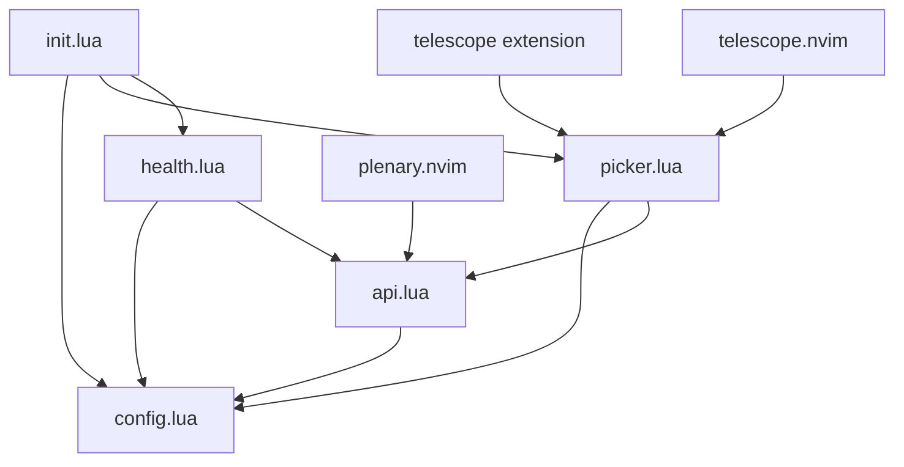

# Architecture Overview

This document describes the architecture and design patterns of the Neovim GitLab Snippets plugin.

## Table of Contents

- [Plugin Structure](#plugin-structure)
- [Module Dependencies](#module-dependencies)
- [Data Flow](#data-flow)
- [Component Responsibilities](#component-responsibilities)
- [State Management](#state-management)
- [Integration Points](#integration-points)
- [Design Patterns](#design-patterns)
- [Error Handling Strategy](#error-handling-strategy)

---

## Plugin Structure

```
neovim-gitlab-snippets/
├── lua/
│   ├── gitlab-snippets/
│   │   ├── init.lua        # Main plugin entry point
│   │   ├── config.lua      # Configuration management
│   │   ├── api.lua         # GitLab API client
│   │   ├── picker.lua      # Telescope UI integration
│   │   └── health.lua      # Health check system
│   └── telescope/
│       └── _extensions/
│           └── gitlab_snippets.lua  # Telescope extension registration
├── tests/
│   ├── minimal_init.lua    # Test environment setup
│   ├── config_spec.lua     # Configuration tests
│   └── health_spec.lua     # Health check tests
└── docs/                    # Documentation files
```

---

## Module Dependencies

### Dependency Graph



### External Dependencies

1. **plenary.nvim**

   - Used for: HTTP requests via `plenary.curl`
   - Required by: `api.lua`
   - Version: Latest stable

2. **telescope.nvim**
   - Used for: UI picker interface
   - Required by: `picker.lua`
   - Version: Latest stable

### Internal Module Relationships

- **init.lua** → Orchestrates all modules, provides public API
- **config.lua** → Manages configuration state, accessed by all modules
- **api.lua** → Handles GitLab API communication, used by picker and health
- **picker.lua** → Manages UI interactions, uses api for data fetching
- **health.lua** → Validates plugin setup, uses api for connection testing

---

## Data Flow

### 1. Plugin Initialization Flow

```
User Config → init.setup() → config.setup() → Store in config.options
```

### 2. Snippet Browsing Flow

```
User Command → picker.pick_instance()
    ↓
Select Instance → picker.pick_snippet_type()
    ↓
Select Type → api.list_*_snippets()
    ↓
API Request → curl.get() → GitLab API
    ↓
JSON Response → Parse → picker.display_snippets()
    ↓
Telescope UI → Preview/Actions
```

### 3. Snippet Action Flow

```
User Action (Ctrl+I/Ctrl+N) → picker.insert_snippet()/open_snippet_in_buffer()
    ↓
Fetch Content → api.get_snippet_content()
    ↓
GitLab API → Raw Content
    ↓
Insert/Open → Neovim Buffer
```

### 4. Health Check Flow

```
:checkhealth → health.check()
    ↓
Dependency Checks → require() validation
    ↓
Configuration Checks → config.options validation
    ↓
Connection Tests → api.test_connection()
    ↓
Report Results → vim.health API
```

---

## Component Responsibilities

### init.lua - Main Entry Point

**Responsibilities:**

- Plugin initialization and setup
- Command registration (`:GitLabSnippets`)
- Public API exposure
- Health check coordination

**Key Functions:**

- `setup(opts)` - Initialize plugin with user configuration
- `health()` - Run health checks
- `pick_instance(opts)` - Start snippet browsing workflow

### config.lua - Configuration Management

**Responsibilities:**

- Store and manage plugin configuration
- Merge user options with defaults
- Provide configuration access to other modules

**Key Data:**

- `defaults` - Default configuration values
- `options` - Active configuration after setup

**Key Functions:**

- `setup(opts)` - Merge configurations
- `get_instance(name)` - Retrieve instance configuration

### api.lua - GitLab API Client

**Responsibilities:**

- Handle all GitLab API communication
- Manage authentication via tokens
- Error handling and status code interpretation
- Data transformation from API responses

**Key Functions:**

- `request()` - Generic API request handler
- `list_*_snippets()` - Fetch snippet collections
- `get_snippet_content()` - Fetch raw snippet content
- `test_connection()` - Validate instance connectivity

**Authentication:**

- Retrieves tokens from environment variables
- Supports instance-specific tokens
- Falls back to default token

### picker.lua - UI Management

**Responsibilities:**

- Telescope picker creation and configuration
- User interaction handling
- Preview generation (content and metadata)
- Action execution (insert, open in buffer)
- State management for preview modes

**Key Functions:**

- `pick_*()` - Various picker creation functions
- `display_snippets()` - Main snippet display with preview
- `insert_snippet()` - Insert at cursor
- `open_snippet_in_buffer()` - Open in new buffer

**UI Components:**

- Instance picker
- Snippet type selector
- Project browser
- Snippet list with preview

### health.lua - Diagnostics System

**Responsibilities:**

- Validate plugin dependencies
- Check configuration validity
- Test API connections
- Report issues to user

**Health Checks:**

- Dependency availability (plenary, telescope)
- Platform compatibility
- Neovim version
- Instance configuration
- Token availability
- API connectivity

---

## State Management

### Configuration State

- **Location:** `config.options`
- **Scope:** Global, persistent during session
- **Mutability:** Set once during setup
- **Access:** Read-only after initialization

### Preview State

- **Location:** `picker.preview_state`
- **Scope:** Module-level, persistent during session
- **Purpose:** Track content/metadata toggle per snippet
- **Key Format:** `{instance_name}_{snippet_id}`

### Session State

The plugin maintains minimal session state:

1. Configuration (immutable after setup)
2. Preview preferences (persists during session)
3. No persistent storage between sessions

---

## Integration Points

### Telescope Integration

**Extension Registration:**

```lua
telescope.register_extension({
  exports = {
    gitlab_snippets = picker.pick_instance
  }
})
```

**Custom Components:**

- Custom previewer with metadata toggle
- Custom action mappings (Enter, Ctrl+I, Ctrl+N)
- Dynamic picker chaining (instance → type → snippets)

### Neovim Integration

**Commands:**

- `:GitLabSnippets` - User command registration
- `:checkhealth gitlab-snippets` - Health check integration

**Buffer Operations:**

- `nvim_buf_set_text()` - Insert snippets
- `nvim_buf_set_lines()` - Set buffer content
- `nvim_buf_set_option()` - Set filetype for syntax

### GitLab API Integration

**API Version:** v4

**Endpoints Used:**

- `/api/v4/user` - Connection testing
- `/api/v4/snippets` - Personal snippets
- `/api/v4/snippets/public` - Public snippets
- `/api/v4/snippets/all` - All snippets (admin)
- `/api/v4/projects/{id}/snippets` - Project snippets
- `/api/v4/snippets/{id}/raw` - Raw content

---

## Design Patterns

### 1. Module Pattern

Each Lua file returns a table (module) with public functions:

```lua
local M = {}
M.public_function = function() ... end
return M
```

### 2. Configuration Pattern

Centralized configuration with defaults and merging:

```lua
M.defaults = { ... }
M.options = {}
M.setup = function(opts)
  M.options = vim.tbl_deep_extend("force", {}, M.defaults, opts or {})
end
```

### 3. Error Handling Pattern

Consistent error returns with nil and message:

```lua
function M.api_call()
  if error_condition then
    return nil, "Error message"
  end
  return result
end
```

### 4. Lazy Loading Pattern

Modules are loaded on demand using `require()`:

```lua
M.pick_instance = function(opts)
  require("gitlab-snippets.picker").pick_instance(opts)
end
```

### 5. Builder Pattern (Telescope Pickers)

Chained configuration for complex UI components:

```lua
pickers.new(opts, {
  prompt_title = "...",
  finder = finders.new_table({ ... }),
  sorter = conf.generic_sorter(opts),
  previewer = custom_previewer(),
  attach_mappings = function() ... end
}):find()
```

---

## Error Handling Strategy

### API Errors

**HTTP Status Codes:**

- 401 → Authentication error (token issues)
- 403 → Permission denied (scope issues)
- 404 → Resource not found
- 500 → Server error

**Error Propagation:**

```
API Error → api.lua returns (nil, error_msg)
    ↓
picker.lua checks result → vim.notify() to user
```

### Dependency Errors

**Missing Dependencies:**

- Caught during plugin load
- Reported via health check
- Graceful degradation where possible

### Configuration Errors

**Invalid Configuration:**

- Validated during setup
- Reported via health check
- Falls back to defaults

### User Input Errors

**Invalid Actions:**

- Handled at UI level
- User-friendly error messages
- No stack traces shown

---

## Performance Considerations

### Caching Strategy

- No persistent caching implemented
- Preview state cached during session
- API responses not cached (always fresh)

### Lazy Loading

- Modules loaded on demand
- Telescope extension loaded when needed
- Preview content fetched only when displayed

### Resource Management

- Single API connection per request
- No background polling
- Minimal memory footprint
- Preview buffers reused

---

## Security Considerations

### Token Management

- Tokens never stored in code
- Retrieved from environment variables
- Instance-specific token support
- No token logging or display

### API Communication

- HTTPS only for API requests
- Token sent in headers, not URL
- No sensitive data in error messages

### User Data

- No data persistence between sessions
- No telemetry or usage tracking
- No external dependencies beyond GitLab

---

## Future Architecture Considerations

### Potential Enhancements

1. **Caching Layer**

   - Cache snippet metadata
   - Expire cache on timer
   - Invalidate on changes

2. **Async Operations**

   - Use Neovim's async APIs
   - Non-blocking API requests
   - Progress indicators

3. **Extended Actions**

   - Edit snippets
   - Create new snippets
   - Delete snippets

4. **Search and Filtering**

   - Full-text search
   - Tag-based filtering
   - Language filtering

5. **Multi-Account Support**
   - Multiple tokens per instance
   - Account switching

---

## Version History

- **v0.0.1** - Initial architecture
- **v0.0.2** - Added testing infrastructure, removed utils module

---

**Last Updated:** 2025-08-09  
**Plugin Version:** v0.0.2
